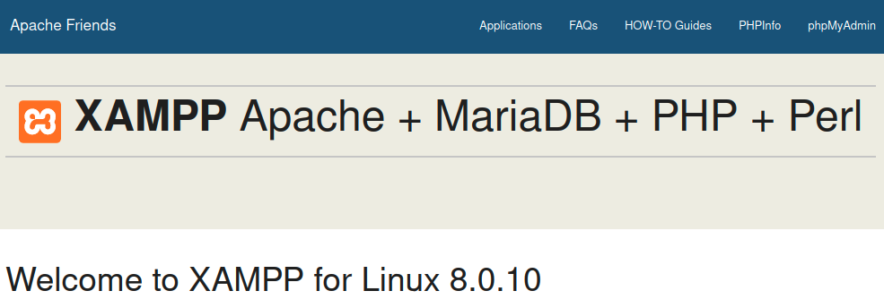
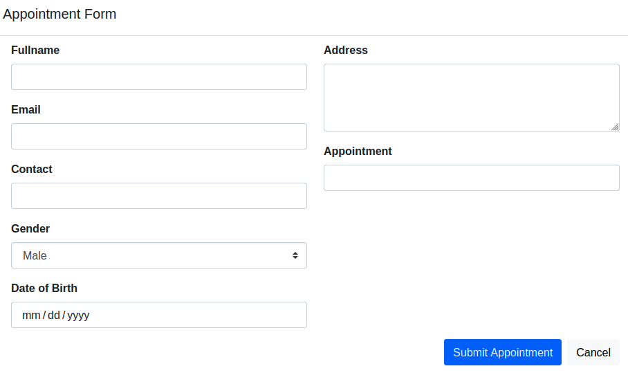
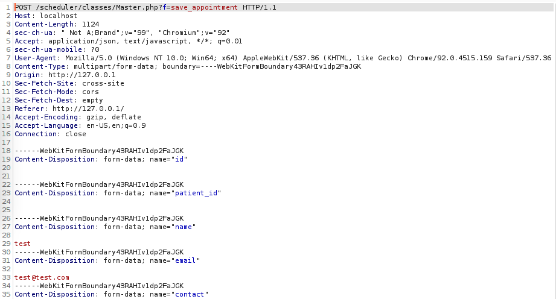
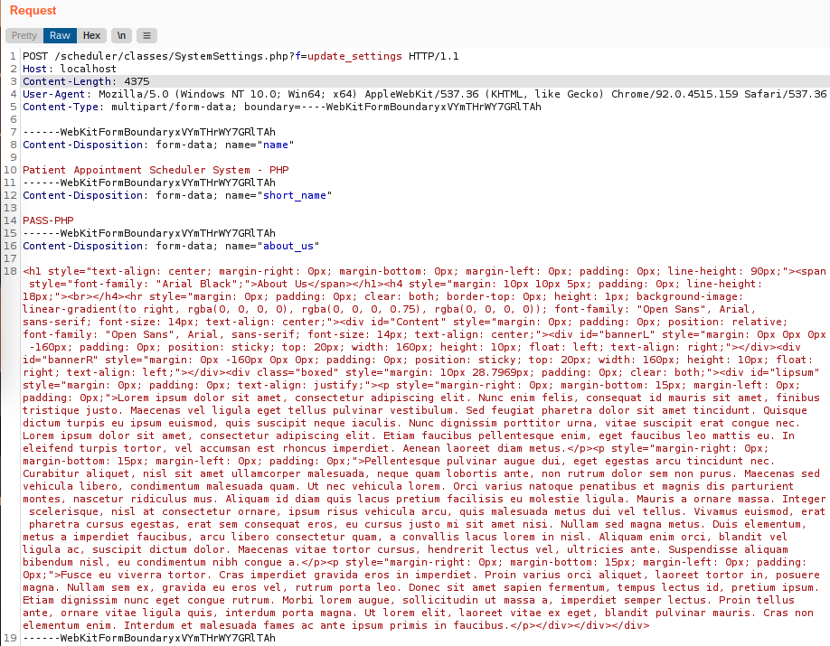

- [Setup](#setup)
  * [Test Settings](#test-settings)
  * [Test Environment](#test-environment)
- [Vulnerabilities](#vulnerabilities)
  * [Schedule Appointment UNION SQL Injection](#schedule-appointment-union-sql-injection)
  * [Login Bypass SQL Injection](#login-bypass-sql-injection)
  * [Unauthenticated Stored XSS](#unauthenticated-stored-xss)
  * [Unauthenticated File Upload and RCE](#unauthenticated-file-upload-and-rce)

<small><i><a href='http://ecotrust-canada.github.io/markdown-toc/'>Table of contents generated with markdown-toc</a></i></small>

# Setup

## Test Settings

- XAMPP 8.0.10-0
- Ubuntu 20.04.3 LTS (Focal Fossa)

## Test Environment

- Install XAMPP: https://www.apachefriends.org/index.html
- Start XAMPP:

```bash
sudo /opt/lampp/lampp start
```

- Browse to http://127.0.0.1/dashboard/ to see the following:

  

- Download website sourcecode: https://www.sourcecodester.com/php/14928/patient-appointment-scheduler-system-using-php-free-source-code.html

- Unpack source code into `/opt/lampp/htdocs`:

```bash
sudo unzip ~/Downloads/appointment_scheduler.zip -d /opt/lampp/htdocs/
```

- Browse to http://127.0.0.1/phpmyadmin and create a new DB called `scheduler_db`:

  

- Select the Import tab and import `/opt/lampp/htdocs/scheduler/database/scheduler_db.sql`:

  

- Browse to http://127.0.0.1/scheduler to see the following:

  

# Vulnerabilities

## Schedule Appointment UNION SQL Injection

From the main page, there is a link to `Schedule Appintment Now`. This brings up the following form:



Enter some test data and intercept the request using [BurpSuite](https://portswigger.net/burp/communitydownload):



The POST request goes to `clases/Master.php` with the argument `f=save_appointment`. Looking at the source shows a valid SQL injection for the function that processes this input:

```php
function save_appointment() {
  extract($_POST);
  $sched_set_qry = $this->conn->query("SELECT * FROM `schedule_settings`");
  $sched_set = array_column($sched_set_qry->fetch_all(MYSQLI_ASSOC),'meta_value','meta_field');
  $morning_start = date("Y-m-d ") . explode(',',$sched_set['morning_schedule'])[0];
  $morning_end = date("Y-m-d ") . explode(',',$sched_set['morning_schedule'])[1];
  $afternoon_start = date("Y-m-d ") . explode(',',$sched_set['afternoon_schedule'])[0];
  $afternoon_end = date("Y-m-d ") . explode(',',$sched_set['afternoon_schedule'])[1];
  $sched_time = date("Y-m-d ") . date("H:i",strtotime($date_sched));
  if (!in_array(strtolower(date("l",strtotime($date_sched))),
                explode(',',strtolower($sched_set['day_schedule'])))) {
    $resp['status'] = 'failed';
    $resp['msg'] = "Selected Schedule Day of Week is invalid.";
    return json_encode($resp);
    exit;
  }
  if (!((strtotime($sched_time) >= strtotime($morning_start) &&
         strtotime($sched_time) <= strtotime($morning_end)) || 
        (strtotime($sched_time) >= strtotime($afternoon_start) && 
         strtotime($sched_time) <= strtotime($afternoon_end)))) {
    $resp['status'] = 'failed';
    $resp['msg'] = "Selected Schedule Time is invalid.";
    return json_encode($resp);
    exit;
  }
  // injection is here
  $check = $this->conn->query("SELECT * FROM `appointments` where ('".strtotime($date_sched)."' Between unix_timestamp(date_sched) and unix_timestamp(DATE_ADD(date_sched, interval 30 MINUTE)) OR '".strtotime($date_sched.' +30 mins')."' Between unix_timestamp(date_sched) and unix_timestamp(DATE_ADD(date_sched, interval 30 MINUTE))) ".($id >0 ? " and id != '{$id}' " : ""))->num_rows;
  $this->capture_err();
  if ($check > 0) {
    $resp['status'] = 'failed';
    $resp['msg'] = "Selected Schedule DateTime conflicts to other appointment.";
    return json_encode($resp);
    exit;
  }
  ... // omitted
}
```

The injection occurs with the `id` field of the POST request. The user controls this value and can use it escape the query and create a UNION with whatever data the user wants. To abuse this, the number of columns needs to be known for the `appointments` table. Browse to `http://127.0.0.1/phpmyadmin` to see the following:


Since there are 6 columns, the following value for `id` will attempt to generate the file `/tmp/test.txt` through SQL injection:

- `INTO OUTFILE` Reference: https://mariadb.com/kb/en/select-into-outfile/

```
69' UNION ALL SELECT 'a','b','c','d','e','f' INTO OUTFILE '/tmp/test.txt'-- bubba
```

Send this using Burp and receive the following response:


This will generate the following file:


This proves the vulnerability. However, to use it for remote code execution to upload a webshell, it requires knowledge of the following:

- Where on the target system to place the webshell based on where the website is being served from.
- Which operating system is running on the target server. The path changes on Windows/Linux/OSX (all of which XAMPP can run on).

For example, to upload a PHP webshell, the attacker needs to know the absolute path that the website is being served from on the target machine. In this case, it is `/opt/lampp/htdocs/scheduler` for XAMPP running on Linux. So an example injection can specify the target path as `/opt/lampp/htdocs/scheduler/shell.php`. However, **any relative path used will only be relative to the installation of MySQL** on the target machine and is very likely not being hosted to allow for remote code execution. 

## Login Bypass SQL Injection

The admin interface is at http://127.0.0.1/admin and shows the following login form:


Enter some test data and intercept the request using [BurpSuite](https://portswigger.net/burp/communitydownload):


This request goes to `classes/Login.php` with the argument `f=login`. Looking at the source code shows a valid SQL injection to bypass the login form:

```php
public function login() {
  extract($_POST);
  $qry = $this->conn->query("SELECT * from users where username = '$username' and password = md5('$password') ");
  if ($qry->num_rows > 0){
    foreach ($qry->fetch_array() as $k => $v) {
      if (!is_numeric($k) && $k != 'password') {
        $this->settings->set_userdata($k,$v);
      }
    }
    $this->settings->set_userdata('login_type', 1);
  return json_encode(array('status'=>'success'));
  } else {
  return json_encode(array('status'=>'incorrect','last_qry'=>"SELECT * from users where username = '$username' and password = md5('$password') "));
  }
}
```

Since the default admin user has the username `admin` use the following for the username to login as the administrator:

- **NOTE:** password value does not matter

```
admin' or 1=1#
```

## Unauthenticated Stored XSS

In the admin portal, there is a way to update system settings and modify the HTML content of the main page:


Submitting this form and intercepting the POST request in Burp shows that the request is going to `classes/SystemSettings.php` with the argument `f=update_settings` and the only sanitization being that HTML content with `'` is being escaped for the SQL statement:



Looking at the code in `classes/SystemSettings.php` shows that this request does not require authentication. Since this form submission does not require authentication, any remote user can modify the content of the website and inject JavaScript that will execute whenever a user browses to the website.

- A PoC for this vulnerability can be found [here](./stored_xss.py). It can be used as follows:


**NOTE:** This PoC can fail if the `about.html` file is not writable by the XAMPP daemon. Ensure this by running the following in your test environment:

```bash
sudo chmod 666 /opt/lampp/htdocs/scheduler/about.html
```

## Unauthenticated File Upload and RCE

In the admin portal, there is a way to update system settings for the website:


This website allows for you to upload a website cover and system logo. Submitting this form and intercepting the POST request in Burp shows that the request is going to `classes/SystemSettings.php` with the argument `f=update_settings` (same as previous vulnerability). Looking at the source code shows there is no authentication check for this submission and that the user supplied file gets placed at `uploads/` with whatever filename the user provided in the POST request:

```php
function update_settings_info() {
  // ... omitted
  if (isset($_FILES['img']) && $_FILES['img']['tmp_name'] != '') {
    $fname = 'uploads/'.strtotime(date('y-m-d H:i')).'_'.$_FILES['img']['name'];
    $move = move_uploaded_file($_FILES['img']['tmp_name'],'../'. $fname);
    if (isset($_SESSION['system_info']['logo'])) {
      $qry = $this->conn->query("UPDATE system_info set meta_value = '{$fname}' where meta_field = 'logo' ");
      if (is_file('../'.$_SESSION['system_info']['logo'])) {
        unlink('../'.$_SESSION['system_info']['logo']); 
      }
    } else {
      $qry = $this->conn->query("INSERT into system_info set meta_value = '{$fname}',meta_field = 'logo' ");
    }
  }
  if (isset($_FILES['cover']) && $_FILES['cover']['tmp_name'] != ''){
    $fname = 'uploads/'.strtotime(date('y-m-d H:i')).'_'.$_FILES['cover']['name'];
    $move = move_uploaded_file($_FILES['cover']['tmp_name'],'../'. $fname);
    if (isset($_SESSION['system_info']['cover'])) {
      $qry = $this->conn->query("UPDATE system_info set meta_value = '{$fname}' where meta_field = 'cover' ");
      if (is_file('../'.$_SESSION['system_info']['cover'])) {
        unlink('../'.$_SESSION['system_info']['cover']);
      }
    } else {
      $qry = $this->conn->query("INSERT into system_info set meta_value = '{$fname}',meta_field = 'cover' ");
    }
  }
  // ... omitted
}
```

This allows for any unauthenticated user to upload a PHP webshell and acheive remote code execution on the target webserver.

- A PoC for this vulnerability can be found [here](./file_upload_rce.py). It can be used as follows:


**NOTE:** This PoC can fail if the `uploads` directory is not writable by the XAMPP daemon. Ensure this by running the following in your test environment:

```bash
sudo chmod 777 /opt/lampp/htdocs/scheduler/uploads
```

**NOTE:** This PoC can fail if the local time on the target server is vastly different than the attacker's machine. This is because the PHP server code will create the new filename in the `uploads` directory with the epoch timestamp prepended to the payload filename provided by the attacker. The PoC exploit code will attempt to bruteforce this timestamp by trying a range of delays. This is in reference to the following line of PHP code:

```php
$fname = 'uploads/'.strtotime(date('y-m-d H:i')).'_'.$_FILES['img']['name'];
$move = move_uploaded_file($_FILES['img']['tmp_name'],'../'. $fname);
```


